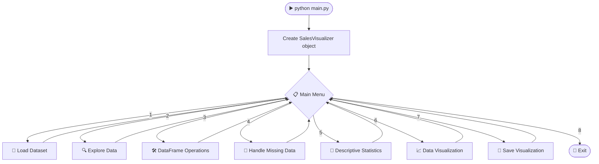
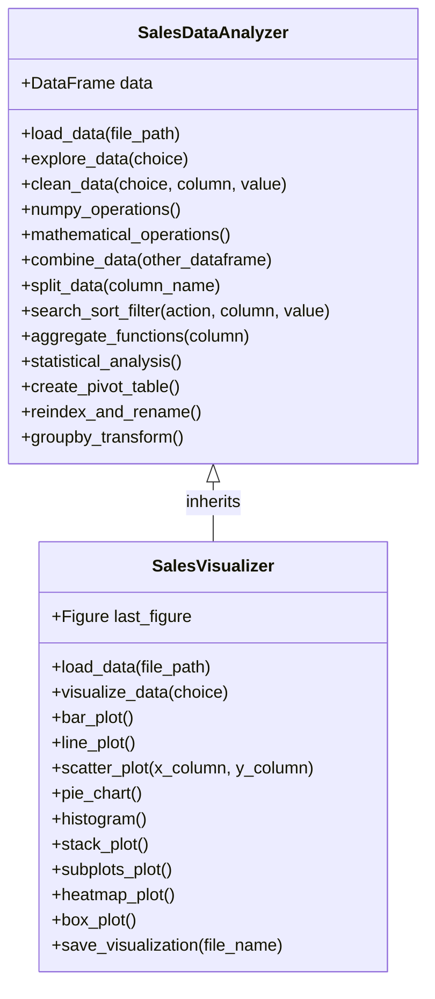

<!-- ===================== HEADER BANNER (animated) ===================== -->
<div align="center">


<!-- Typing animation -->


<br/>


<br/>

<!-- Funny GIF 1 -->


<sub><i>Me writing this project at 2 AM: "I have no idea what I'm doing" 🐶💻 (but it works!)</i></sub>

</div>

---

## 📚 Table of Contents

1. [📊 Project at a Glance](#-project-at-a-glance)
2. [🎯 About The Project](#-about-the-project)
3. [🎬 Demo Video](#-demo-video)
4. [✨ Features](#-features)
5. [🔄 How The Program Works](#-how-the-program-works)
6. [🖥️ Program Menu Preview](#️-program-menu-preview)
7. [📁 Project Structure](#-project-structure)
8. [🏗️ Architecture & Method Reference](#️-architecture--method-reference)
9. [🧱 OOP Concepts Used](#-oop-concepts-used)
10. [✅ Requirements Checklist](#-requirements-checklist)
11. [🗃️ Dataset Details & Sample Insights](#️-dataset-details--sample-insights)
12. [🧰 Tech Stack](#-tech-stack)
13. [🚀 How To Run](#-how-to-run)
14. [🛠️ Troubleshooting](#️-troubleshooting)
15. [📝 Assumptions](#-assumptions)
16. [🎓 What I Learned](#-what-i-learned)
17. [🔮 Future Improvements](#-future-improvements)
18. [👨‍💻 Author](#-author)

---

## 📊 Project at a Glance

<div align="center">

</div>

| 📌 Item | 📈 Details |
|---------|-----------|
| **Project name** | Pandas Analyzer & Data Visualization (Sales Data Visualizer) |
| **Language** | Python 🐍 |
| **Libraries used** | `numpy`, `pandas`, `matplotlib`, `seaborn` (nothing else) |
| **Python files** | 5 files (about **970 lines** of code with comments) |
| **Classes** | 2 → `SalesDataAnalyzer` and `SalesVisualizer` |
| **Methods** | 21 in the analyzer class + 20 in the visualizer class + 9 menu functions |
| **Main menu options** | 8 |
| **Plots available** | 9 (7 Matplotlib + 2 Seaborn) |
| **Dataset size** | 1000 rows × 8 columns (years 2022 to 2024) |
| **Type of program** | Console, menu driven |
| **Programming style** | Object Oriented Programming (OOP) |

<div align="center">


<sub><i>My cat helping me type these 970 lines of code 🐱⌨️</i></sub>

</div>

---

## 🎯 About The Project

**Sales Data Visualizer** is a menu-driven Python program that reads a sales dataset (CSV file), cleans it, analyzes it and draws colourful charts from it 📊.

A business always wants to know things like:

- 💰 Which **region** sells the most?
- 📦 Which **product** gives the biggest share of sales?
- 📅 Which **month** was the best (and the worst)?
- 📉 Is the sales amount **growing** year by year?

This project answers these questions with the help of **Pandas** (data handling), **NumPy** (arrays), **Matplotlib** and **Seaborn** (charts), all inside a simple console menu 🧭. You just run the program, choose an option, and the program does the work. No coding needed while using it! 😎

The code is written for **beginners** 🌱: simple variable names, small methods, and comments in every file.

<div align="center">

<!-- Funny GIF 2 -->


<sub><i>Me and my DataFrame, staying calm while the data loads 🦫</i></sub>

</div>

---

## 🎬 Demo Video

<div align="center">

### 📺 Watch the full working demo here 👇

> ### 🔗 **Demo Video Link:** [`https://drive.google.com/file/d/12YKI5swwMtKOZDLH8dWNS9icXz01d9ms/view?usp=sharing')

<!--
HOW TO USE:
1. Upload your screen-recording to YouTube / Google Drive / LinkedIn.
2. Replace PASTE_YOUR_VIDEO_LINK_HERE (in 2 places above) with your link.
-->

</div>

---

## ✨ Features

| # | Menu Option | What it does | Emoji |
|---|-------------|--------------|:----:|
| 1 | **Load Dataset** | Reads a CSV file (with error handling if file is missing or empty) | 📂 |
| 2 | **Explore Data** | First 5 rows, last 5 rows, column names, data types, basic info | 🔍 |
| 3 | **DataFrame Operations** | NumPy arrays, math operations, concat / merge, split, search / sort / filter, aggregates, pivot table, re-index, groupby + transform | 🛠️ |
| 4 | **Handle Missing Data** | Show missing rows, fill with mean, drop rows, replace with a value | 🧹 |
| 5 | **Descriptive Statistics** | describe(), standard deviation, variance, quantiles, percentiles | 📐 |
| 6 | **Data Visualization** | 9 different plots (see below) | 📈 |
| 7 | **Save Visualization** | Saves the last plot as PNG / JPEG | 💾 |
| 8 | **Exit** | Closes the program politely | 👋 |

### 🛠️ Option 3 → "DataFrame Operations" Sub-Menu

| Sub-option | Operation | Library tools used |
|:---:|-----------|--------------------|
| 1 | NumPy arrays: indexing, slicing, boolean indexing, 2D arrays | `to_numpy()`, `[:5]`, `[::10]`, `[:, 1]` |
| 2 | Math operations: Sales with tax, Cost, Profit Margin | element-wise NumPy operations |
| 3 | Combine data: add rows from another CSV / merge product totals | `pd.concat()`, `pd.merge()` |
| 4 | Split data by Region or Product | boolean masks, `unique()` |
| 5 | Search / Sort / Filter | `str.contains()`, `sort_values()`, conditions |
| 6 | Aggregate functions: sum, mean, count, min, max (also per region) | `groupby().agg()` |
| 7 | Pivot table (Sales by Region and Year) | `pd.pivot_table()` |
| 8 | Re-index and rename labels | `set_index()`, `rename()`, `reindex()` |
| 9 | Group by and transform | `groupby().transform()` |

### 🎨 Plots Available

| # | Plot | Library | What it shows |
|:-:|------|---------|---------------|
| 1 | 📊 Bar Plot | Matplotlib | Total sales of each region |
| 2 | 📈 Line Plot | Matplotlib | Monthly sales trend |
| 3 | 🔵 Scatter Plot | Matplotlib | Any two columns you choose (for example Sales vs Year) |
| 4 | 🥧 Pie Chart | Matplotlib | Share of each product in total sales |
| 5 | 📶 Histogram | Matplotlib | How the sales amounts are spread |
| 6 | 🏔️ Stack Plot | Matplotlib | Monthly sales stacked by region |
| 7 | 🧩 Subplots | Matplotlib | Bar + Pie + Histogram + Line in one figure (dashboard) |
| 8 | 🔥 Heatmap | Seaborn | Correlation between the number columns |
| 9 | 📦 Box Plot | Seaborn | Sales spread and outliers in each region |

All plots have **titles, axis labels and legends** ✅ and can be saved as **PNG / JPEG** 💾

<div align="center">

<!-- Funny GIF 3 -->


<sub><i>Programmers turning coffee into charts ☕➡️📊</i></sub>

</div>

---

## 🔄 How The Program Works

### 🧭 Program Flow



### 🔁 Data Pipeline


**In simple words:**

1. 🏁 `main.py` creates the analyzer object and starts the menu.
2. 🧭 `menu.py` shows the menu again and again until the user selects **8 (Exit)**.
3. 🧠 When the user picks an option, the menu only asks for input and calls a method of the analyzer / visualizer object.
4. 🎨 The `SalesVisualizer` class keeps the **last plot** in memory, so option 7 can save it to a file.
5. 🛡️ If the user types something wrong (a wrong file name, a wrong column name, letters instead of numbers), the program prints a friendly message instead of crashing.

<div align="center">


<sub><i>Me, before I added error handling to the program 😰🐱</i></sub>

</div>

---

## 🖥️ Program Menu Preview

```text
========== Data Analysis & Visualization Program ==========
Please select an option:
1. Load Dataset
2. Explore Data
3. Perform DataFrame Operations
4. Handle Missing Data
5. Generate Descriptive Statistics
6. Data Visualization
7. Save Visualization
8. Exit
===========================================================

Enter your choice:
```

<details>
<summary>👀 <b>Click to see an example console run</b></summary>

```text
Enter your choice: 1

== Load Dataset ==
Enter the path of the dataset (CSV file): sales_data.csv
Dataset loaded successfully!

Enter your choice: 2

== Explore Data ==
1. Display the first 5 rows
Enter your choice: 1

   SalesID       Date    Product      Region  Quantity  Sales  Profit  Year
0      101 2022-01-01  Product E        East        18   1620  346.98  2022
1      102 2022-01-01  Product E  West Coast        17   1530  347.60  2022
2      103 2022-01-02  Product C     Central        13   1560   81.26  2022
3      104 2022-01-02  Product E        East        13   1170  122.17  2022
4      105 2022-01-04  Product C       South        15   1800  387.76  2022

Enter your choice: 6

== Data Visualization ==
3. Scatter Plot
Enter your choice: 3

== Scatter Plot ==
Enter x-axis column name: Sales
Enter y-axis column name: Year
Generating scatter plot...
Scatter plot displayed successfully!

Enter your choice: 7

== Save Visualization ==
Enter file name to save the plot (e.g., scatter_plot.png): scatter_plot.png
Visualization saved as scatter_plot.png successfully!

Enter your choice: 8

Exiting the program. Goodbye!
```

</details>

<details>
<summary>📊 <b>Click to see a sample Pivot Table output (Sales by Region and Year)</b></summary>

```text
Year          2022    2023    2024      All
Region
Central      68890   65465   73075   207430
East         57250   69365   72600   199215
North        69215   61485   80535   211235
South        53320   59095   55610   168025
West Coast   72615   69640   92405   234660
All         321290  325050  374225  1020565
```

</details>

<div align="center">

<!-- Funny GIF 4 -->


<sub><i>My laptop while plotting 1000 rows 🔥💻</i></sub>

</div>

---

## 📁 Project Structure

```text
📦 sales-data-visualizer
 ┣ 📜 main.py                -> ▶️  Starts the program (run this file)
 ┣ 📜 menu.py                -> 🧭 Menu / user interface
 ┣ 📜 sales_analyzer.py      -> 🧠 SalesDataAnalyzer class (all data work)
 ┣ 📜 sales_visualizer.py    -> 🎨 SalesVisualizer class (all plots)
 ┣ 📜 create_dataset.py      -> 🏭 Makes the sales_data.csv file
 ┣ 📄 sales_data.csv         -> 🗃️  Sales dataset (1000 rows)
 ┗ 📘 README.md              -> 📖 You are here!
```

| File | Lines (approx.) | Job |
|------|:---------------:|-----|
| `main.py` | 24 | Creates the object and starts the menu |
| `menu.py` | 237 | All the questions asked to the user |
| `sales_analyzer.py` | 408 | Data loading, cleaning, operations, statistics |
| `sales_visualizer.py` | 229 | All Matplotlib and Seaborn plots, saving plots |
| `create_dataset.py` | 75 | Builds the sample sales dataset |

---

## 🏗️ Architecture & Method Reference

### 🧬 Class Diagram



<details>
<summary>🧠 <b><code>SalesDataAnalyzer</code> methods (sales_analyzer.py)</b></summary>

| Method | What it does |
|--------|--------------|
| `__init__()` | Creates `self.data` and loads a file if a path is given |
| `__del__()` | Small cleanup when the object is deleted |
| `__add__()` | Joins the data of two analyzers (`analyzer1 + analyzer2`) |
| `is_data_loaded()` | Checks that a dataset is loaded before any operation |
| `has_columns()` | Checks that the needed columns exist |
| `convert_data_types()` | Converts `Date` to datetime and `Sales`, `Profit`, `Quantity` to numbers |
| `load_data()` | Reads the CSV file with exception handling |
| `read_other_file()` | Reads a second CSV file for combining |
| `explore_data()` | head, tail, columns, dtypes, info |
| `clean_data()` | Show / fill / drop / replace missing values |
| `numpy_operations()` | NumPy indexing and slicing demo |
| `mathematical_operations()` | Adds `Sales_With_Tax`, `Cost`, `Profit_Margin` columns |
| `combine_data()` | Adds rows from another DataFrame (concat) |
| `merge_product_totals()` | Merges total sales of each product into the data |
| `split_data()` | Splits the data by Region or Product |
| `search_sort_filter()` | Search, sort and filter rows |
| `aggregate_functions()` | sum, mean, count, min, max |
| `statistical_analysis()` | describe, std, var, quantiles, percentiles |
| `create_pivot_table()` | Pivot table of sales by region and year |
| `reindex_and_rename()` | Re-index and rename labels (on a copy) |
| `groupby_transform()` | Adds `Region_Avg_Sales` and `Sales_Vs_Region_Avg` |

</details>

<details>
<summary>🎨 <b><code>SalesVisualizer</code> methods (sales_visualizer.py)</b></summary>

| Method | What it does |
|--------|--------------|
| `__init__()` | Calls the parent constructor with `super()` and sets the Seaborn theme |
| `load_data()` | **Overrides** the parent method and also clears the old plot |
| `visualize_data()` | Calls the right plot method for the menu choice |
| `bar_plot()` / `line_plot()` / `scatter_plot()` | Basic Matplotlib plots |
| `pie_chart()` / `histogram()` / `stack_plot()` | More Matplotlib plots |
| `subplots_plot()` | 4 plots in one figure |
| `heatmap_plot()` / `box_plot()` | Seaborn plots |
| `save_visualization()` | Saves the last plot as PNG / JPEG |
| `_draw_*()` and `_show_plot()` | Small helper methods used by the plot methods |

</details>

<details>
<summary>🧭 <b>Functions in <code>menu.py</code></b></summary>

| Function | What it does |
|----------|--------------|
| `show_main_menu()` | Prints the main menu |
| `ask_number()` | Keeps asking until the user types a number |
| `load_dataset_menu()` | Option 1 |
| `explore_menu()` | Option 2 |
| `operations_menu()` | Option 3 (sub-menu with 9 items) |
| `missing_data_menu()` | Option 4 |
| `visualization_menu()` | Option 6 |
| `save_visualization_menu()` | Option 7 |
| `run_menu()` | The main loop that runs until Exit |

</details>

---

## 🧱 OOP Concepts Used

| Concept 🎓 | Where it is used |
|-----------|------------------|
| **Class & Object** | `SalesDataAnalyzer`, `SalesVisualizer` |
| **Encapsulation** | Data and all its methods are inside the `SalesDataAnalyzer` class (`self.data`) |
| **Constructor** | `__init__()` creates the object and can load data |
| **Destructor** | `__del__()` does small cleanup |
| **Inheritance** | `SalesVisualizer` inherits from `SalesDataAnalyzer` |
| **super()** | Used in `SalesVisualizer.__init__()` and `load_data()` |
| **Method Overriding** | `SalesVisualizer.load_data()` overrides the parent method |
| **Operator Overloading** | `__add__()` joins two analyzers using `analyzer1 + analyzer2` |

<div align="center">


<sub><i>SalesVisualizer after inheriting everything from SalesDataAnalyzer 😼👔</i></sub>

</div>

---

## ✅ Requirements Checklist

| Requirement from the project description | Done | Where |
|------------------------------------------|:----:|-------|
| Load sales data from a CSV file and handle exceptions | ✅ | `load_data()` |
| Explore data using `head()`, `info()`, `describe()` | ✅ | Menu option 2 |
| Identify and handle missing data | ✅ | Menu option 4 → `clean_data()` |
| Perform data type conversions | ✅ | `convert_data_types()` |
| **A.** NumPy arrays: creation, indexing, slicing | ✅ | Option 3 → 1 → `numpy_operations()` |
| **B.** Math operations, combining and splitting data | ✅ | Option 3 → 2, 3, 4 |
| **C.** Search, sort, filter, aggregate functions | ✅ | Option 3 → 5, 6 |
| **D.** Statistical functions (std, var, percentiles, quantile) | ✅ | Menu option 5 → `statistical_analysis()` |
| **E.** Matplotlib: Bar, Line, Scatter, Pie, Histogram, Stack plot | ✅ | Option 6 → 1 to 6 |
| **E.** Legends, titles, subplots, saving images (PNG / JPEG) | ✅ | All plots, option 6 → 7, option 7 |
| **F.** Seaborn: heatmap, box plot, styling | ✅ | Option 6 → 8, 9 and `sns.set_theme()` |
| Pivot tables, re-indexing, `groupby()` and `transform()` | ✅ | Option 3 → 7, 8, 9 |
| OOP: class, encapsulation, inheritance, `super()`, overriding | ✅ | Both classes |
| Operator overloading (optional) | ✅ | `__add__()` |
| Menu driven interface with Exit option | ✅ | `menu.py` |
| Only `numpy`, `pandas`, `matplotlib`, `seaborn` used | ✅ | All files |

<div align="center">


<sub><i>Me ticking the very last ✅ in the checklist 🎸🐱</i></sub>

</div>

---

## 🗃️ Dataset Details & Sample Insights

Kaggle sales datasets were not downloadable while building this project, so `create_dataset.py` creates a **Kaggle-style sales dataset** using NumPy and Pandas (1000 rows, from **2022-01-01** to **2024-12-31**, no missing values by default).

| Column | Meaning |
|--------|---------|
| `SalesID` | Unique id of every sale |
| `Date` | Date of sale |
| `Product` | Product A to Product E |
| `Region` | North, South, East, West Coast, Central |
| `Quantity` | Number of items sold |
| `Sales` | Quantity × price of the product |
| `Profit` | 5% to 30% of the sales |
| `Year` | Year taken from the Date |

> 💡 **Want to use your own Kaggle dataset?** Just keep the column names `Date`, `Product`, `Region`, `Sales` and `Profit`, and the program will work with it too.

### 🔎 Quick Insights From The Sample Data

| 🧐 Question | 💡 Answer |
|------------|-----------|
| Total sales | **1,020,565** |
| Total profit | **178,277.80** |
| Average profit margin | about **17.35 %** |
| Best region 🏆 | **West Coast** (234,660) |
| Weakest region 📉 | **South** (168,025) |
| Best product 🥇 | **Product D** (31.0 % of all sales) |
| Weakest product 🥉 | **Product A** (9.4 % of all sales) |
| Best year 📅 | **2024** (374,225), then 2023 (325,050) and 2022 (321,290) |
| Best month 🌟 | **October 2023** (45,625) |
| Worst month 😬 | **August 2023** (15,460) |
| Sales per order | min 50, median 900, mean about 1,020.56, max 3,000 |

> ℹ️ These numbers are for the **sample dataset** made by `create_dataset.py`. If you use another dataset, your numbers will be different.

<div align="center">

<!-- Funny GIF 5 -->


<sub><i>Me when the pie chart finally shows the right percentages ⌨️🥧</i></sub>

</div>

---

## 🧰 Tech Stack

| Tool | Why it is used |
|------|----------------|
| 🐍 **Python 3** | Main programming language |
| 🐼 **Pandas** | Reading CSV, cleaning, grouping, pivot tables, merging |
| 🔢 **NumPy** | Arrays, indexing, slicing, element-wise math, percentiles |
| 📉 **Matplotlib** | Bar, line, scatter, pie, histogram, stack plot, subplots, saving images |
| 🎨 **Seaborn** | Heatmap, box plot and nice plot styling |

---

## 🚀 How To Run

### 1️⃣ Install the libraries

```bash
pip install numpy pandas matplotlib seaborn
```

### 2️⃣ Put all files in the same folder 📂

Keep these exact names: `main.py`, `menu.py`, `sales_analyzer.py`, `sales_visualizer.py`, `create_dataset.py`.

### 3️⃣ *(Optional)* Create a fresh dataset

```bash
python create_dataset.py
```

> `sales_data.csv` is already included, so you can skip this step. 😉
> Want missing values to test the cleaning menu? Set `add_missing_values = True` inside `create_dataset.py` first.

### 4️⃣ Start the program ▶️

```bash
python main.py
```

*(On Mac / Linux you may need `python3 main.py`)*

### 5️⃣ Load the data

When the program asks for the dataset path, type:

```text
sales_data.csv
```

Now enjoy exploring the data! 🎉

---

## 🛠️ Troubleshooting

<div align="center">


<sub><i>"It's not a bug, it's a feature!" 😅🐛</i></sub>

</div>

<details>
<summary>😵 <b>The program looks stuck after I choose a plot</b></summary>

The plot opens in a **separate window** (sometimes behind your editor or terminal). The menu waits until you **close the plot window**. Close it and the menu comes back. ✅

</details>

<details>
<summary>❌ <b>ModuleNotFoundError: No module named 'sales_analyzer'</b></summary>

Your files are not in the same folder, or a file was renamed (for example `sales_analyzer (1).py`). Rename it back and run `python main.py` from that folder.

</details>

<details>
<summary>📦 <b>ModuleNotFoundError: No module named 'seaborn' (or pandas / numpy / matplotlib)</b></summary>

Run: `pip install numpy pandas matplotlib seaborn`

</details>

<details>
<summary>📄 <b>File not found while loading the dataset</b></summary>

Check that `sales_data.csv` is in the folder you started the program from, and that you typed the name correctly.

</details>

<details>
<summary>🔤 <b>"Column ... is not in the dataset" message</b></summary>

Column names are case sensitive. Type `Sales`, not `sales`. Use **Explore Data → Display column names** to see the exact names.

</details>

---

## 📝 Assumptions

- The dataset is a **CSV file** with columns like `Date`, `Product`, `Region`, `Sales`, `Profit`.
- If the file has no `Year` column, it is created from the `Date` column.
- `Date` is converted to a datetime type, and `Sales`, `Profit`, `Quantity` are converted to numbers when the data is loaded.
- The Bar, Line, Pie, Histogram, Stack, Heatmap and Box plots use fixed columns (`Region`, `Product`, `Sales`, `Date`). Only the Scatter plot asks for column names.
- While combining two CSV files, duplicate rows are removed by comparing the columns that both files have.
- "Fill with mean" works only on number columns.
- Saved plots go in the same folder where the program is running.

---

## 🎓 What I Learned

- 🐼 Handling real-world style data with **Pandas** (cleaning, grouping, merging, pivot tables).
- 🔢 Using **NumPy** arrays for indexing, slicing and fast element-wise maths.
- 📊 Making clear and good-looking charts with **Matplotlib** and **Seaborn**.
- 🧱 Using **OOP** (classes, inheritance, `super()`, overriding, operator overloading) in a real project.
- 🧭 Building a **menu-driven** program that does not crash when the user types something wrong.
- 🧪 Splitting a project into small files so the code stays clean and easy to read.

<div align="center">


<sub><i>Me after learning Pandas, NumPy, Matplotlib and Seaborn 💃🐱</i></sub>

</div>

---

## 🔮 Future Improvements

- [ ] 📤 Export analysis results to a new CSV file
- [ ] 🗓️ Filter data between two dates
- [ ] 🖼️ Simple GUI version (Tkinter)
- [ ] 🤖 Sales prediction using a basic model

<div align="center">


<sub><i>Me thinking about building the GUI version next ☕😵</i></sub>

</div>

---

<div align="center">

<!-- Funny GIF 6 -->


<sub><i>Me after fixing the last bug and the code finally runs 🕺🐛</i></sub>

<br/><br/>

## 👨‍💻 Author


### ✍️ **Author: Nihar Sheladiya**

*Python • Data Analysis • Data Visualization*

<br/>

⭐ **If you liked this project, don't forget to give it a star!** ⭐

<br/>


</div>
